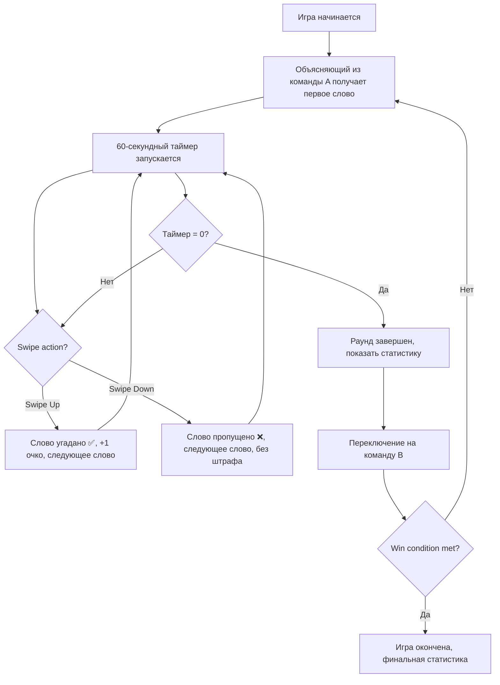

# Product Requirements Document (PRD)
## Поясни (Poyasni.ru) — MVP Release

**Document Owner:** Product Manager  
**Last Updated:** February 14, 2026  
**Version:** 1.1 — Updated Branding  
**Status:** ✅ Ready for Development

---

## 🔄 Branding Update Notes

**Previous name:** Alias Web (PartyFlow)  
**New name:** Поясни (Poyasni.ru)

**Rationale for change:**
- ✅ **Instant recognition:** "Поясни" = русский императив, понятен всем
- ✅ **Meme culture fit:** "Поясни за..." — популярная фраза в русском интернете
- ✅ **Verbal virality:** Легко сказать вслух: "Давай в Поясни сыграем"
- ✅ **Domain availability:** poyasni.ru короткий и запоминающийся
- ✅ **SEO advantage:** Уникальное название vs generic "Alias Web"

**What changed in PRD:**
- All references to "PartyFlow" → "Поясни"
- All references to "Alias Web" → "Поясни"
- Domain: partyflow.ru → poyasni.ru
- Product positioning updated to emphasize Russian-first approach

---

## Table of Contents

1. [Executive Summary](#1-executive-summary)
2. [Product Vision & Goals](#2-product-vision--goals)
3. [User Personas & Use Cases](#3-user-personas--use-cases)
4. [Feature Scope: MVP vs Post-MVP](#4-feature-scope-mvp-vs-post-mvp)
5. [Module 1: Room & Lobby System](#5-module-1-room--lobby-system)
6. [Module 2: Core Game Loop](#6-module-2-core-game-loop)
7. [Module 3: Word Pack System](#7-module-3-word-pack-system)
8. [Module 4: Dual-Screen Sync](#8-module-4-dual-screen-sync)
9. [Module 5: PWA Installation](#9-module-5-pwa-installation)
10. [Technical Architecture](#10-technical-architecture)
11. [Non-Functional Requirements](#11-non-functional-requirements)
12. [Success Metrics & KPIs](#12-success-metrics--kpis)
13. [Risk Management](#13-risk-management)
14. [Go-to-Market Strategy](#14-go-to-market-strategy)
15. [Appendix](#15-appendix)

---

## 1. Executive Summary

### 1.1 Product Overview

**Поясни (Poyasni.ru)** — браузерная многопользовательская игра в жанре "объясни слово", которая устраняет friction традиционных настольных игр через:
- **Zero-install gameplay:** QR-код → играй сразу (никаких установок)
- **Real-time multiplayer:** WebSocket-синхронизация для 2-10 игроков
- **Актуальный контент:** Современные слова для Gen Z + миллениалов (20-35 лет)
- **Dual-screen support:** Телефон как контроллер + планшет/ноут как табло

### 1.2 Problem Statement

**Текущие проблемы с существующими играми типа Alias:**

1. **Физические настолки:**
   - "Кто-то забыл коробку, карты залиты пивом"
   - Устаревший контент: "синхрофазотрон", "кочерга"
   
2. **Мобильные приложения-клоны:**
   - Требуется скачивание из App Store (5+ минут setup на группу)
   - Фрагментация платформ (iOS vs Android sync issues)
   - Плохой UX, реклама, лаги

3. **Существующие веб-игры:**
   - Низкое качество
   - Ненадежные WebSocket-соединения
   - Нет поддержки двух экранов

### 1.3 Solution

Поясни решает эти проблемы через:
- **Browser-based PWA:** Без установки, работает на всех устройствах
- **QR-code onboarding:** 2 тапа от главной до старта игры (<60 секунд)
- **Надежная WebSocket архитектура:** <200ms latency, автоматический reconnect
- **Party-proof UX:** 72-96px шрифты, haptic feedback, защита от случайных свайпов
- **Встроенный viral loop:** 1 хост → 8-10 игроков → 2-3 новых хоста (target K=1.2-1.5)

### 1.4 MVP Success Criteria

| Метрика | Target | Период измерения |
|---------|--------|------------------|
| **K-factor** | >1.0 (устойчивый виральный рост) | 30 дней |
| **Длина сессии** | >15 минут | За игровую сессию |
| **D1 retention** | >40% | День после первой игры |
| **D7 retention** | >15% | Неделя после первой игры |
| **Время onboarding** | <90 секунд (главная → первый раунд) | User testing |
| **Accidental swipe rate** | <5% от всех свайпов | Gameplay analytics |
| **WebSocket stability** | >95% uptime во время сессий | Server monitoring |

### 1.5 Business Model

**MVP (100% бесплатно):**
- Один "Стартовый пак" (50 слов)
- Нет монетизации до валидации K-factor >1.0

**Post-MVP (Freemium):**
- Премиум паки слов: ₽99-299 за пак
- Target conversion: 5-10% от хостов
- Projected ARPU: ₽10-15 на хоста
- Break-even conversion: 0.08% (unit economics validated)

---

## 2. Product Vision & Goals

### 2.1 Vision Statement

> "Сделать вечериночные игры такими же простыми, как отправить мем — никаких скачиваний, никакой подготовки, просто отсканируй и играй."

### 2.2 Product Positioning

**Ключевое отличие:**
- Актуальный контент vs устаревшие слова конкурентов
- Zero-friction onboarding vs многоминутная установка приложений
- Social-first experience vs single-device gameplay
- **Русскоязычный фокус:** Название "Поясни" резонирует с мемной культурой

**Конкурентная среда:**

| Продукт | Тип | Onboarding | Контент | Наше преимущество |
|---------|------|------------|---------|-------------------|
| Alias (mobile app) | Native app | 5+ мин setup | Устаревший | Zero-install + актуальный контент + название "Поясни" |
| Heads Up! | Native app | App Store download | Англоязычный | Русская локализация + PWA + мемное название |
| Psych! | Native app | Сложная синхронизация | Rigid formats | Простота + swipe UX + "Поясни за..." культура |
| Codenames Online | Web | Хороший | English-focused | Более динамичный геймплей + русский язык |

**Почему "Поясни" лучше "PartyFlow":**
- ❌ PartyFlow: англоязычный, сложно произносить, нет культурного контекста
- ✅ Поясни: мгновенно понятно, мемная отсылка ("поясни за..."), легко сказать вслух

### 2.3 Target Audience

**Primary:** Party Animal (Саша, 26 лет)
- Маркетолог в IT, организует вечеринки 2-3 раза в месяц
- JTBD: "Быстро развлечь 6-10 друзей без awkward пауз"
- Success = запустили за <60 сек, все смеются, кто-то просит линк
- **Резонанс с "Поясни":** Знаком с мемом "поясни за...", сразу понимает концепцию

**Secondary:** Corporate Organizer (Лена, 32 года)
- HR-менеджер, организует тимбилдинги для 15-30 человек
- JTBD: "Простая активность для team bonding без cringe"
- Willingness to pay: ₽1500-3000 за кастомные паки
- **Резонанс с "Поясни":** Универсальное название, подходит для офиса

**Tertiary:** Casual Gamer (Дима, 29 лет)
- Backend разработчик, любит настолки, ценит quality
- JTBD: "Хорошо сделанная игра, которая не стыдно рекомендовать"
- Замечает детали: полировка, game balance, отсутствие багов
- **Резонанс с "Поясни":** Оценит продуманность названия и культурную интеграцию

### 2.4 MVP Goals

**Phase 1 (Weeks 1-4): Nail the Viral Loop**
- Достичь K-factor >1.0 через оптимизацию post-game CTA
- Валидировать onboarding flow (<90 сек до первого раунда)
- Тестирование с 50-100 группами early adopters

**Phase 2 (Weeks 5-8): Validate Engagement**
- D7 retention >15%
- Avg 1.8+ сессий на хоста
- Qualitative feedback: >70% "would host again"

**Phase 3 (Weeks 9-12): Monetization Soft Launch**
- Запуск 3 premium паков
- Target 3-5% conversion
- Поддержание K-factor >1.0 (монетизация не должна убить виральность)

---

## 3. User Personas & Use Cases

### 3.1 Primary Persona: Party Animal (Саша)

**Demographics:**
- 26 лет, маркетолог в IT
- Доход: 120-150k ₽/мес
- Москва/СПб, снимает квартиру с друзьями
- Активен в Instagram, TikTok, Telegram

**Psychographics:**
- Экстраверт, организатор вечеринок
- Early adopter новых продуктов
- Ценит простоту и актуальность
- "Я тот, кто придумывает, чем заняться"

**Jobs To Be Done:**
> "Когда наступает awkward пауза на вечеринке, мне нужно быстро развлечь 6-10 человек без объяснения правил, чтобы все были в моменте и веселились вместе"

**User Journey:**

```
1. Саша замечает awkward паузу на вечеринке
2. Открывает poyasni.ru на телефоне
3. Нажимает "Новая игра" → видит QR-код
4. Друзья сканируют QR → попадают в lobby
5. Саша нажимает "Старт" (60 секунд прошло)
6. Игра идёт 20 минут, несколько моментов смеха
7. Post-game: "Хочешь создать свою игру?" CTA
8. 2-3 друга создают свои игры → вирусный цикл
```

**Почему "Поясни" резонирует:**
- Саша знаком с мемом "поясни за..." из VK и Telegram
- Название вызывает улыбку: "Окей, давай в Поясни!"
- Легко объяснить друзьям: "Это типа Alias, но называется Поясни"

**Pain Points:**
- Физический Alias: коробка забыта, карты старые
- App-based games: долгая установка, sync issues
- Объяснение правил убивает вайб

**Success Metrics:**
- Onboarding <60 сек
- 2+ моментов смеха за игру
- Кто-то просит линк ("вирусный индикатор")

---

### 3.2 Secondary Persona: Corporate Organizer (Лена)

**Demographics:**
- 32 года, HR/People Ops в IT-компании (50-150 человек)
- Доход: 180-220k ₽
- Организует 3-4 тимбилдинга в год

**Jobs To Be Done:**
> "Когда я организую team event на 15-30 человек, мне нужна активность без cringe, которая подходит интровертам и экстравертам, чтобы команда расслабилась и узнала друг друга"

**User Journey:**

```
1. Лена планирует quarterly team offsite
2. Гуглит "игры для тимбилдинга" → находит Поясни
3. Тестирует на небольшой группе (6 человек)
4. Запускает на реальном ивенте (20 человек, 2 комнаты)
5. Post-event: "Хочу кастомный пак про нашу компанию"
6. Готова платить ₽1500-3000 за custom content
```

**Почему "Поясни" работает для корпоративов:**
- Название нейтральное, не слишком молодежное
- "Поясни" звучит профессионально, можно использовать в офисе
- Нет негативных коннотаций (в отличие от "PartyFlow" = пати = алкоголь?)

**Pain Points:**
- Классические тимбилдинги: дорого, cringe
- Board games: не масштабируются на 20+ человек
- Mafia: половина "мертвы" и скучают

**Monetization Potential:**
- Highest willingness to pay
- Recurring revenue (quarterly events)
- B2B upsell: "Create Your Own Pack" (Post-MVP)

---

### 3.3 Tertiary Persona: Casual Gamer (Дима)

**Demographics:**
- 29 лет, backend developer
- Доход: 200-250k ₽
- Посещает игротеки, играет в Codenames, Dixit

**Jobs To Be Done:**
> "Мне нужна хорошо сделанная игра, которая не уступает физическим настолкам, но не требует таскать коробку, чтобы я мог рекомендовать её без стыда за execution"

**Почему "Поясни" привлекает:**
- Дима оценит clever naming: "Поясни" = короткое, запоминающееся, культурно релевантное
- Название показывает, что команда понимает аудиторию
- Не generic "Alias Clone #47"

**Pain Points:**
- Мобильные клоны: "поделки, full of ads, лагают"
- Web-игры: "low effort, кривая синхронизация"

**What he notices:**
- Полировка: плавные анимации, responsive UI
- Game balance: честный таймер, понятный счёт
- Details: "О, тут используется Framer Motion, приятно"
- **Branding:** "Поясни — крутое название, умно придумали"

**Success Criteria:**
- Zero bugs during first session
- Animations smooth (60fps)
- Content quality: не банальные слова
- Название не вызывает cringe

---

## 4. Feature Scope: MVP vs Post-MVP

### 4.1 MVP Feature Set (Must Have)

**Module 1: Room & Lobby System**
- ✅ Хост создает комнату → QR-код + shareable link
- ✅ Гость сканирует QR → присоединяется без регистрации
- ✅ Auto-generated player names ("Игрок 1", "Игрок 2")
- ✅ Auto team assignment (сбалансированные команды)
- ✅ Real-time player join updates (WebSocket)
- ✅ Кнопка старта игры (disabled если <4 игроков)

**Module 2: Core Game Loop**
- ✅ Показ слова на телефоне объясняющего
- ✅ Swipe UX: вверх = угадано, вниз = пропущено
- ✅ Синхронизированный 60-секундный таймер
- ✅ Haptic feedback (вибрация при свайпе)
- ✅ Подсчет очков (real-time updates)
- ✅ Статистика раунда

**Module 3: Word Pack System**
- ✅ Один "Стартовый пак" (50 слов)
- ✅ Difficulty mix: 30% easy, 50% medium, 20% hard
- ✅ Без монетизации (100% бесплатно в MVP)

**Module 4: Dual-Screen Sync**
- ✅ Телефон = контроллер (показывает слова, swipe interface)
- ✅ Планшет/Ноутбук = табло (таймер, счет, БЕЗ слов)
- ✅ Real-time state sync via WebSocket

**Module 5: PWA Installation**
- ✅ "Добавить на главный экран" prompt после первой игры
- ✅ Offline fallback: сообщение "Подключитесь к WiFi"

---

### 4.2 Post-MVP Features (Nice to Have)

**Phase 2: Content & Monetization (Month 3-4)**
- 💰 Premium паки слов (₽99-299)
- 💰 Preview пака перед покупкой
- 💰 3 launch пака: "IT-офис", "Мемы 2024", "18+ Жара"
- 🎨 Выбор пака в lobby (сейчас hardcoded Стартовый)

**Phase 3: Engagement & Retention (Month 5-6)**
- 📊 История игр: статистика прошлых игр
- 🏆 Achievements: "Объяснил 100 слов", "Win streak 5"
- 📈 Leaderboard: топ игроков среди друзей
- 🎯 Ручное формирование команд (drag & drop)
- ⏱ Кастомная длительность раунда (45/60/90 сек)

**Phase 4: Viral Mechanics (Month 7-9)**
- 📸 Share game highlights (скриншот + результаты)
- 🔗 Приглашение друзей через WhatsApp/Telegram
- 🎁 Реферальные награды: unlock premium pack за 5 приглашений
- 🌐 Viral coefficient tracking dashboard

**Phase 5: Advanced Features (Month 10-12)**
- 🛠 "Создай свой пак" (B2B монетизация)
- 🎭 Несколько режимов игры (Шарады, Крокодил)
- 🌍 Мультиязычность (English, Ukrainian)
- 💬 Чат в игре

---

### 4.3 Explicitly Out of Scope (Not in Roadmap)

**НЕ будем строить:**
- ❌ User accounts / authentication (только session-based)
- ❌ Voice chat (используйте внешние приложения типа Discord)
- ❌ Запись геймплея на видео
- ❌ Matchmaking с незнакомцами (только для друзей)
- ❌ AI-generated words
- ❌ Cross-platform sync (только web, никаких native apps)

---

## 5. Module 1: Room & Lobby System

### 5.1 Overview

**Purpose:** Позволить хосту создать игровую комнату и гостям присоединиться через QR-код или shareable link без friction.

**User Flow:**

```mermaid
graph TD
    A[Хост открывает poyasni.ru] --> B[Tap "Новая игра"]
    B --> C[Комната создана, показан QR-код]
    C --> D[Гости сканируют QR / кликают по ссылке]
    D --> E[Гости в lobby, auto-named]
    E --> F[Auto team assignment]
    F --> G{Минимум 4 игрока?}
    G -->|Да| H[Хост тапает "Старт"]
    G -->|Нет| I[Кнопка Старт disabled]
    H --> J[Переход к Game Loop]
```

### 5.2 Functional Requirements

#### FR-1.1: Room Creation

**Description:** Хост создает новую игровую комнату с уникальным идентификатором

**User Story:**
```
As a Host,
I want to create a game room with one tap,
So that I can instantly start organizing a party game
```

**Acceptance Criteria:**
- [ ] Tap "Новая игра" генерирует уникальный room ID (формат: `[A-Z0-9]{6}`)
- [ ] Room ID URL-safe и легко произносится вслух (например, `XY3M9K`)
- [ ] QR-код генерируется, содержит shareable link: `poyasni.ru/r/{roomId}`
- [ ] Shareable link копируется одним тапом
- [ ] Комната сохраняется 24 часа или до момента завершения игры хостом
- [ ] Максимум 100 одновременных комнат на один server instance

**Technical Details:**
- Room state хранится в Redis с 24h TTL
- Room ID collision check (regenerate если существует)
- WebSocket connection устанавливается при создании комнаты

---

#### FR-1.2: QR Code Display

**Description:** Хост видит QR-код и shareable link для присоединения гостей

**User Story:**
```
As a Host,
I want to see a large QR code on my screen,
So that guests can scan it with their phone cameras
```

**Acceptance Criteria:**
- [ ] QR-код размером: минимум 300x300px на mobile, 400x400px на tablet
- [ ] QR-код содержит URL: `https://poyasni.ru/r/{roomId}`
- [ ] QR-код имеет 2-секундную pulse animation (тонкий "waiting" индикатор)
- [ ] Shareable link показывается под QR с кнопкой "Скопировать ссылку"
- [ ] Copy link дает haptic feedback + тост "Скопировано!" (2 сек)
- [ ] QR-код сканируется с 30-50см расстояния

**Edge Cases:**
- Если QR generation fails → показать только shareable link с сообщением об ошибке
- Если хост уходит со страницы → комната остается активной, можно вернуться через URL

---

#### FR-1.3: Guest Join via QR / Link

**Description:** Гости сканируют QR-код или кликают shareable link для входа в lobby

**User Story:**
```
As a Guest,
I want to scan a QR code and join without registration,
So that I can start playing immediately
```

**Acceptance Criteria:**
- [ ] Сканирование QR открывает `poyasni.ru/r/{roomId}` в дефолтном браузере
- [ ] Клик по shareable link открывает тот же URL
- [ ] Нет login, registration или запроса персональной информации
- [ ] Гостю авто-присваивается имя: "Игрок {N}" (N = порядок присоединения)
- [ ] Случайный emoji avatar присваивается (🎮🎯🎪🎨🎭🎬🎸🎹 pool из 20)
- [ ] WebSocket connection устанавливается в течение 500ms
- [ ] Join success подтверждается haptic feedback

**Edge Cases:**
- Комната не существует → redirect на главную с ошибкой "Комната не найдена"
- Комната заполнена (10 игроков) → показать "Комната заполнена, попробуйте позже"
- Игра уже началась → показать "Игра уже началась, дождитесь следующего раунда" (Post-MVP: allow mid-game join)
- Плохое WiFi → retry WebSocket connection до 3 раз с exponential backoff

---

#### FR-1.4: Lobby Screen (Host View)

**Description:** Хост видит всех подключенных игроков с team assignments

**User Story:**
```
As a Host,
I want to see who joined in real-time,
So that I can start when everyone is ready
```

**Acceptance Criteria:**
- [ ] Список игроков обновляется в real-time (<500ms latency)
- [ ] Каждая player card показывает: emoji avatar, имя, цвет команды
- [ ] Игроки авто-распределяются в Team A (синяя) или Team B (оранжевая)
- [ ] Team balance: ±1 игрок max (4v4, 3v3, 5v4 allowed; 5v3 not allowed)
- [ ] Staggered fade-in animation (100ms задержка на каждого игрока)
- [ ] Confetti burst animation при достижении 4 игроков (минимальный порог)
- [ ] Player count displayed: "Игроков: {N}/10"

**Auto Team Assignment Logic:**
```javascript
// Игроки присоединяются последовательно, назначаются поочередно
Игрок 1 → Команда A
Игрок 2 → Команда B
Игрок 3 → Команда A
Игрок 4 → Команда B
// etc.
```

**Edge Cases:**
- Игрок отключается → удалить из списка, rebalance команды если нужно
- Хост отключается → авто-повышение следующего игрока до хоста (первый присоединившийся)
- Никто не присоединяется через 5 мин → показать "Поделитесь ссылкой с друзьями!" reminder

---

#### FR-1.5: Player Name Editing (Optional)

**Description:** Игроки могут опционально изменить свои auto-generated имена

**User Story:**
```
As a Guest,
I want to change my name from "Игрок 1" to my actual name,
So that my friends recognize me
```

**Acceptance Criteria:**
- [ ] Tap на player card → inline text input появляется
- [ ] Максимальная длина имени: 15 символов
- [ ] Name validation: нет profanity filter в MVP (trust-based)
- [ ] Изменение имени broadcast всем игрокам в lobby через WebSocket
- [ ] Пустое имя возвращается к "Игрок {N}"
- [ ] Дубликаты имен разрешены (нет uniqueness constraint)

**Out of Scope (MVP):**
- ❌ Profanity filter (Post-MVP)
- ❌ Name history / saved names
- ❌ Avatar customization (locked to random emoji)

---

#### FR-1.6: Start Game Button

**Description:** Хост может начать игру когда минимум игроков собрано

**User Story:**
```
As a Host,
I want to start the game when everyone is ready,
So that we can begin playing
```

**Acceptance Criteria:**
- [ ] Кнопка Старт видна всегда на lobby screen
- [ ] Кнопка **disabled** (серая) если <4 игроков
- [ ] Кнопка **enabled** (зеленая, prominent) если ≥4 игроков
- [ ] Tooltip на disabled кнопке: "Минимум 4 игрока для старта"
- [ ] Tap на enabled кнопку переводит в Core Game Loop (Module 2)
- [ ] Transition animation: 300ms fade-out
- [ ] Все игроки получают "GAME_STARTED" WebSocket event одновременно

**Edge Cases:**
- Игрок отключается прямо перед стартом → если <4 остается, disable кнопку
- Хост тапает быстро → debounce чтобы предотвратить duplicate game starts
- WebSocket disconnected → показать "Потеряно соединение" error, retry connection

---

### 5.3 WebSocket Events (Module 1)

**Event: ROOM_CREATED**
```json
{
  "event": "ROOM_CREATED",
  "data": {
    "roomId": "XY3M9K",
    "hostId": "uuid-1234",
    "qrCodeUrl": "https://poyasni.ru/r/XY3M9K",
    "createdAt": "2026-02-14T14:30:00Z"
  }
}
```

**Event: PLAYER_JOINED**
```json
{
  "event": "PLAYER_JOINED",
  "data": {
    "roomId": "XY3M9K",
    "playerId": "uuid-5678",
    "playerName": "Игрок 3",
    "avatar": "🎸",
    "team": "A",
    "joinedAt": "2026-02-14T14:31:00Z"
  }
}
```

**Event: PLAYER_LEFT**
```json
{
  "event": "PLAYER_LEFT",
  "data": {
    "roomId": "XY3M9K",
    "playerId": "uuid-5678",
    "leftAt": "2026-02-14T14:35:00Z"
  }
}
```

**Event: PLAYER_NAME_CHANGED**
```json
{
  "event": "PLAYER_NAME_CHANGED",
  "data": {
    "roomId": "XY3M9K",
    "playerId": "uuid-5678",
    "newName": "Саша",
    "changedAt": "2026-02-14T14:32:00Z"
  }
}
```

**Event: GAME_STARTED**
```json
{
  "event": "GAME_STARTED",
  "data": {
    "roomId": "XY3M9K",
    "teams": {
      "A": ["uuid-1", "uuid-3", "uuid-5"],
      "B": ["uuid-2", "uuid-4", "uuid-6"]
    },
    "currentRound": 1,
    "startedAt": "2026-02-14T14:33:00Z"
  }
}
```

---

### 5.4 UI/UX Specifications

**Lobby Screen Wireframe Elements:**

```
┌─────────────────────────────────┐
│   [ПОЯСНИ Logo]                 │
│                                 │
│   ┌─────────────────┐           │
│   │   [QR CODE]     │  ← 300x300px
│   │                 │  ← Pulse animation (2s)
│   └─────────────────┘           │
│                                 │
│   poyasni.ru/r/XY3M9K           │
│   [📋 Скопировать] ← Tap to copy│
│                                 │
│   ━━━━━━━━━━━━━━━━━━━━━━━━━━   │
│                                 │
│   Игроков: 6/10                 │
│                                 │
│   ┌─ Команда A ─────────┐       │
│   │ 🎮 Игрок 1          │       │
│   │ 🎸 Саша             │       │
│   │ 🎯 Игрок 3          │       │
│   └─────────────────────┘       │
│                                 │
│   ┌─ Команда B ─────────┐       │
│   │ 🎭 Игрок 2          │       │
│   │ 🎨 Лена             │       │
│   │ 🎬 Игрок 6          │       │
│   └─────────────────────┘       │
│                                 │
│   ┌───────────────────┐         │
│   │     СТАРТ        │ ← Green if ≥4
│   └───────────────────┘         │
└─────────────────────────────────┘
```

**Design Tokens:**
- QR pulse: `@keyframes ping { 0%, 100% { opacity: 1; transform: scale(1) } 50% { opacity: 0.8; transform: scale(1.05) } }`
- Player card fade-in: `animation: fadeIn 300ms ease-in forwards`
- Team colors: Team A = `#3b82f6` (blue-500), Team B = `#f97316` (orange-500)
- Start button disabled: `bg-gray-400`, enabled: `bg-green-500`

---

### 5.5 Non-Functional Requirements (Module 1)

**Performance:**
- QR code generation: <200ms
- WebSocket connection: <500ms
- Player join latency: <500ms (от scan до lobby update)
- Room creation: <1s end-to-end

**Scalability:**
- Поддержка 100 одновременных комнат на server instance
- Поддержка 10 игроков на комнату (hard limit)
- Redis room state: 24h TTL, auto-cleanup

**Reliability:**
- WebSocket reconnection: автоматический с exponential backoff
- Room state persistence: переживает server restarts (Redis)
- Graceful degradation: если WebSocket fails, показать "Переподключение..."

**Security:**
- Room IDs: non-guessable (6 alphanumeric символов = 2.2 миллиарда комбинаций)
- Нет CSRF tokens (session-based, не authenticated)
- Rate limiting: max 10 room creations на IP в час

---

## 6. Module 2: Core Game Loop

### 6.1 Overview

**Purpose:** Позволить объясняющему свайпать слова пока идет таймер, с real-time обновлением счета для всех игроков.

**User Flow:**



### 6.2 Functional Requirements

#### FR-2.1: Word Presentation

**Description:** Объясняющий видит по одному слову за раз на экране телефона

**User Story:**
```
As an Explainer,
I want to see a large, readable word on my screen,
So that I can explain it to my team from arm's length
```

**Acceptance Criteria:**
- [ ] Слово показывается в центре экрана
- [ ] Размер шрифта: 72px на mobile (viewport <768px), 96px на tablet
- [ ] Font weight: 900 (black), высокий контраст (белый на темном градиенте)
- [ ] Слово читается с 60-80см расстояния (тестировалось с iPhone 14 Pro)
- [ ] Слова берутся из текущего пака (Стартовый пак в MVP)
- [ ] Слова перемешиваются при старте раунда (без повторов в одном раунде)
- [ ] Если пул слов исчерпан (unlikely с 50 словами, 60s раундами), перемешать снова

**Edge Cases:**
- Очень длинные слова (>15 символов) → уменьшить размер шрифта чтобы влезло (min 56px)
- Non-Cyrillic слова (Post-MVP: English packs) → ensure font supports charset
- Word fetch error → показать "Ошибка загрузки слов, попробуйте ещё раз"

---

#### FR-2.2: Swipe Mechanics

**Description:** Объясняющий свайпает вверх (угадано) или вниз (пропущено) для перехода к следующему слову

**User Story:**
```
As an Explainer,
I want to swipe words quickly and accurately,
So that I can explain as many as possible in 60 seconds
```

**Acceptance Criteria:**
- [ ] **Swipe Up** (угадано): слово отмечено как correct, +1 очко команде
- [ ] **Swipe Down** (пропущено): слово отмечено как skipped, 0 очков (без штрафа)
- [ ] Swipe detection: минимум 200px/s velocity для регистрации
- [ ] Dead zone: центральные 40% экрана immune к свайпам (предотвращает случайные срабатывания)
- [ ] Swipe должен начинаться с внешних 30% экрана (top/bottom edges)
- [ ] Visual feedback: 300ms flash предыдущего слова + icon (✅ или ❌)
- [ ] Следующее слово появляется сразу после 300ms feedback
- [ ] Swipe latency: <100ms от завершения жеста до следующего слова

**Dead Zone Logic:**
```javascript
const screenHeight = window.innerHeight;
const deadZoneStart = screenHeight * 0.3;
const deadZoneEnd = screenHeight * 0.7;

if (touchY > deadZoneStart && touchY < deadZoneEnd) {
  // Ignore swipe (dead zone)
  return;
}
```

**Edge Cases:**
- Случайный horizontal swipe → ignore (только vertical swipes регистрируются)
- Swipe во время последнего слова раунда → не загружать следующее слово, завершить раунд
- Множественные быстрые swipes → debounce чтобы предотвратить double-counting
- Swipe пока WebSocket disconnected → queue action, sync on reconnect

---

#### FR-2.3: Haptic Feedback

**Description:** Телефон вибрирует при свайпе для тактильного подтверждения

**User Story:**
```
As an Explainer,
I want to feel my phone vibrate when I swipe,
So that I know the action registered (even in noisy environment)
```

**Acceptance Criteria:**
- [ ] **Correct swipe (up):** Одна 50ms вибрация
- [ ] **Skip swipe (down):** Двойная вибрация (30ms-pause-30ms)
- [ ] Haptic срабатывает через Vibration API: `navigator.vibrate([pattern])`
- [ ] Fallback для unsupported devices: только visual pulse animation
- [ ] Haptic intensity: medium (не слишком subtle, не слишком aggressive)

**Haptic Patterns:**
```javascript
// Correct
navigator.vibrate(50);

// Skip
navigator.vibrate([30, 50, 30]);
```

**Browser Compatibility:**
- ✅ Chrome Android, Samsung Internet: полная поддержка
- ⚠️ iOS Safari: vibration работает только при user interaction (swipe подходит)
- ❌ Desktop browsers: нет vibration (graceful degradation)

---

#### FR-2.4: Timer (Synchronized)

**Description:** 60-секундный countdown timer видимый всем игрокам, синхронизированный через WebSocket

**User Story:**
```
As a Player,
I want to see the timer counting down,
So that I know how much time is left
```

**Acceptance Criteria:**
- [ ] Таймер начинается с 60 секунд когда раунд стартует
- [ ] Таймер уменьшается каждую 1 секунду
- [ ] Таймер показывается на: телефоне объясняющего (top-right), scoreboard (prominent)
- [ ] Размер шрифта таймера: 80px (scoreboard), 32px (phone)
- [ ] Цвет таймера меняется: green (60-30s) → yellow (30-10s) → red (10-0s)
- [ ] Timer sync: <500ms deviation между всеми устройствами
- [ ] Сервер — source of truth (клиент показывает server time, не local countdown)
- [ ] Когда таймер достигает 0: раунд завершается, показать round-end stats

**Timer Sync Architecture:**
```
Сервер отправляет TIMER_TICK event каждую секунду:
{
  "event": "TIMER_TICK",
  "data": {
    "roomId": "XY3M9K",
    "remainingSeconds": 45
  }
}

Клиент показывает remainingSeconds + интерполирует между ticks
```

**Edge Cases:**
- WebSocket lag >1s → клиент продолжает интерполировать, resyncs при следующем tick
- Client tab backgrounded (mobile) → resume timer при tab focus
- Server crash mid-round → reconnect, resume from last known state

---

#### FR-2.5: Score Tracking

**Description:** Real-time обновление счета обеих команд

**User Story:**
```
As a Spectator,
I want to see the score update live,
So that I can follow the competition
```

**Acceptance Criteria:**
- [ ] Счет увеличивается на 1 за каждый correct swipe
- [ ] Skip swipes НЕ влияют на счет (нет штрафа в MVP)
- [ ] Счета показываются на scoreboard: Команда A vs Команда B (большой, 192px шрифт)
- [ ] Счета показываются на телефоне: компактный (24px шрифт, top-left угол)
- [ ] Score updates broadcast через WebSocket в течение 200ms после свайпа
- [ ] Score animations: +1 число летит вверх и исчезает (300ms)

**WebSocket Event: WORD_SWIPED**
```json
{
  "event": "WORD_SWIPED",
  "data": {
    "roomId": "XY3M9K",
    "wordId": "uuid-word-123",
    "action": "guessed", // или "skipped"
    "team": "A",
    "newScore": {
      "teamA": 12,
      "teamB": 8
    },
    "timestamp": "2026-02-14T14:40:15Z"
  }
}
```

---

#### FR-2.6: Round End Statistics

**Description:** Показать summary раунда когда таймер достигает 0

**User Story:**
```
As a Player,
I want to see how many words we guessed this round,
So that I can celebrate or strategize
```

**Acceptance Criteria:**
- [ ] Round end screen показывает:
  - Угадано слов: {N}
  - Пропущено слов: {M}
  - Время: 60 секунд
  - Очков заработано: {N} (равно угаданным словам)
- [ ] Round end screen показывается 5 секунд (auto-advance)
- [ ] После 5 сек, переход к ходу следующей команды
- [ ] Хост может тапнуть "Продолжить" чтобы пропустить 5-сек ожидание

**Round End Wireframe:**
```
┌─────────────────────────────────┐
│   Раунд завершён!               │
│                                 │
│   🎯 Угадано: 7 слов           │
│   ❌ Пропущено: 2 слова        │
│   ⏱ Время: 60 секунд           │
│                                 │
│   +7 очков команде A            │
│                                 │
│   Следующий: Команда B          │
│                                 │
│   (Автоматически через 5 сек)   │
│   [Продолжить]                  │
└─────────────────────────────────┘
```

---

#### FR-2.7: Win Condition

**Description:** Игра завершается когда команда достигает 50 очков ИЛИ сыграно 12 раундов

**User Story:**
```
As a Host,
I want the game to end at a clear win condition,
So that there's a satisfying conclusion
```

**Acceptance Criteria:**
- [ ] **Primary condition:** Первая команда до 50 очков побеждает
- [ ] **Fallback condition:** После 12 раундов, наибольший счет побеждает
- [ ] Если ничья после 12 раундов → sudden death (1 extra раунд на команду до разрыва ничьи)
- [ ] Win screen показывает: команду-победителя, финальный счет, длительность игры
- [ ] Win screen включает CTA: "Хочешь создать свою игру?" (viral loop)

**Win Screen Wireframe:**
```
┌─────────────────────────────────┐
│   🎉 Команда A победила!        │
│                                 │
│   Финальный счёт:               │
│   Команда A: 52                 │
│   Команда B: 47                 │
│                                 │
│   Продолжительность: 18 мин     │
│   Всего раундов: 9              │
│                                 │
│   ┌─────────────────────────┐   │
│   │ Хочешь создать свою     │   │
│   │ игру?                   │   │
│   │ [Новая игра]           │   │
│   └─────────────────────────┘   │
│                                 │
│   [Играть ещё раз] [На главную] │
└─────────────────────────────────┘
```

---

### 6.3 WebSocket Events (Module 2)

**Event: ROUND_STARTED**
```json
{
  "event": "ROUND_STARTED",
  "data": {
    "roomId": "XY3M9K",
    "roundNumber": 1,
    "team": "A",
    "explainerId": "uuid-1234",
    "duration": 60,
    "startedAt": "2026-02-14T14:40:00Z"
  }
}
```

**Event: TIMER_TICK**
```json
{
  "event": "TIMER_TICK",
  "data": {
    "roomId": "XY3M9K",
    "remainingSeconds": 45
  }
}
```

**Event: WORD_SWIPED** (см. FR-2.5 выше)

**Event: ROUND_ENDED**
```json
{
  "event": "ROUND_ENDED",
  "data": {
    "roomId": "XY3M9K",
    "roundNumber": 1,
    "stats": {
      "wordsGuessed": 7,
      "wordsSkipped": 2
    },
    "score": {
      "teamA": 7,
      "teamB": 0
    },
    "endedAt": "2026-02-14T14:41:00Z"
  }
}
```

**Event: GAME_ENDED**
```json
{
  "event": "GAME_ENDED",
  "data": {
    "roomId": "XY3M9K",
    "winner": "A",
    "finalScore": {
      "teamA": 52,
      "teamB": 47
    },
    "totalRounds": 9,
    "duration": "18m 30s",
    "endedAt": "2026-02-14T14:58:30Z"
  }
}
```

---

### 6.4 UI/UX Specifications

**Swipe Gameplay Screen (Phone):**

```
┌─────────────────────────────────┐
│  7 : 0      [Команда A] 🔴 45s │ ← Счет : Таймер
│                                 │
│                                 │
│         DEAD ZONE               │
│         (центр 40%)             │
│                                 │
│  ┌───────────────────────────┐  │
│  │                           │  │
│  │      КРИПТОВАЛЮТА         │  │ ← 72-96px шрифт
│  │                           │  │
│  └───────────────────────────┘  │
│                                 │
│         DEAD ZONE               │
│                                 │
│                                 │
│  Swipe ↑ = Угадано             │
│  Swipe ↓ = Пропустить          │
└─────────────────────────────────┘
```

**Design Tokens:**
- Word card: `rounded-[3rem]`, `bg-gradient-to-br from-indigo-600 to-purple-600`
- Word text: `font-black text-white text-center`
- Feedback flash: `@keyframes flash { 0% { opacity: 0 } 50% { opacity: 1 } 100% { opacity: 0 } }`
- Swipe transition: `transform: translateY(-100vh)` (up) or `translateY(100vh)` (down), `duration: 300ms`

---

### 6.5 Non-Functional Requirements (Module 2)

**Performance:**
- Swipe latency: <100ms
- Word change animation: 300ms total
- Timer tick latency: <500ms sync across devices
- Score update latency: <200ms

**Reliability:**
- Swipe actions queued если WebSocket disconnected → sync on reconnect
- Timer продолжается client-side если server lags → resync при следующем tick
- Нет потери слов: все swipes сохраняются в Redis

**Usability:**
- Accidental swipe rate: <5% (validated через dead zone + velocity threshold)
- Шрифт читается с 60cm (тестировалось с iPhone 14 Pro при 72px)
- Haptic feedback ощущается естественно (не раздражает)

---

## 7. Module 3: Word Pack System

### 7.1 Overview

**Purpose:** Предоставить кураторский контент слов для геймплея, с поддержкой future premium packs.

**MVP Scope:**
- Один "Стартовый пак" (50 слов)
- Hardcoded во frontend (нет backend API в MVP)
- Post-MVP: Premium packs, backend API, monetization

### 7.2 Functional Requirements

#### FR-3.1: Starter Pack Content

**Description:** Дефолтный пак слов включенный в MVP

**Acceptance Criteria:**
- [ ] Пак содержит ровно 50 слов
- [ ] Difficulty mix: 15 easy (30%), 25 medium (50%), 10 hard (20%)
- [ ] Слова актуальные для Gen Z + миллениалов (2024-2026)
- [ ] Слова включают: IT-сленг, мемы, современные термины, поп-культуру
- [ ] Нет 18+ контента, нет политики, нет религиозных терминов
- [ ] Все слова объяснимы за 10-15 секунд без однокоренных слов

**Content Categories (Example Mix):**
- IT & Tech (20%): криптовалюта, баг, фича, апдейт, скролл
- Modern Slang (30%): токсик, краш, вайб, кринж, флексить
- Pop Culture (20%): Гарри Поттер, TikTok, Netflix, Spotify
- Abstract (15%): эмпатия, прокрастинация, мотивация
- Everyday (15%): телефон, пицца, кот, диван

**Difficulty Examples:**
- **Easy:** телефон, кот, пицца, TikTok, Spotify
- **Medium:** токсик, краш, вайб, фича, апдейт, кринж
- **Hard:** эмпатия, делегирование, блокчейн, NFT, газлайтинг

---

#### FR-3.2: Word Delivery

**Description:** Слова загружаются и перемешиваются при старте раунда

**Acceptance Criteria:**
- [ ] Слова хранятся как JSON array во frontend (hardcoded в MVP)
- [ ] Слова перемешиваются используя Fisher-Yates algorithm при старте раунда
- [ ] Нет повторов в одном раунде (50 слов, типичный раунд = 6-8 слов)
- [ ] Если раунд превышает 50 слов (unlikely), перемешать и продолжить

**Data Structure:**
```json
{
  "packId": "starter",
  "name": "Стартовый пак",
  "words": [
    { "id": "w1", "text": "криптовалюта", "difficulty": "hard" },
    { "id": "w2", "text": "токсик", "difficulty": "medium" },
    { "id": "w3", "text": "кот", "difficulty": "easy" }
    // ... ещё 47
  ]
}
```

---

#### FR-3.3: Post-MVP: Premium Packs (Out of MVP Scope)

**Description:** Платные паки слов для монетизации (Phase 2)

**Planned Packs (Post-MVP):**
1. **"IT-офис"** (₽199) — для разработчиков и tech companies
2. **"Мемы 2024"** (₽99) — актуальные интернет-мемы
3. **"18+ Жара"** (₽299) — взрослый контент для 21+ вечеринок

**Monetization Features (Post-MVP):**
- Pack preview (5 слов показывается перед покупкой)
- In-app purchase flow (Stripe/YooKassa integration)
- Pack selection в lobby
- "Создай свой пак" (B2B premium, ₽1500-3000)

---

### 7.3 Non-Functional Requirements (Module 3)

**Performance:**
- Word shuffle: <50ms
- Word fetch (hardcoded): instant (нет network call)

**Content Quality:**
- 70%+ слов оценены как "норм" или "огонь" в playtesting
- <10% слов оценены как "что это?" или "слишком сложно"

---

## 8. Module 4: Dual-Screen Sync

### 8.1 Overview

**Purpose:** Позволить телефону быть контроллером (показывает слова) + планшету/ноуту быть табло (показывает таймер, счет, но БЕЗ слов чтобы предотвратить читерство).

**Architecture:**
- Телефон подписывается на WebSocket events: WORD_SWIPED, TIMER_TICK
- Планшет подписывается на те же events, но фильтрует word content
- Оба устройства рендерят одинаковый state с разным UI

### 8.2 Functional Requirements

#### FR-4.1: Phone = Controller Mode

**Description:** Телефон объясняющего показывает слова и принимает swipe input

**User Story:**
```
As an Explainer,
I want to see words only on my phone,
So that opponents can't read ahead and cheat
```

**Acceptance Criteria:**
- [ ] Телефон показывает: текущее слово, таймер, счет (компактно)
- [ ] Телефон — единственное устройство, которое рендерит word text
- [ ] Swipe input обрабатывается на телефоне
- [ ] Телефон отправляет WORD_SWIPED event на сервер при свайпе

---

#### FR-4.2: Tablet/Laptop = Scoreboard Mode

**Description:** Большой экран показывает таймер и счет для всех зрителей, но скрывает слова

**User Story:**
```
As a Host,
I want to display the game on a large screen,
So that everyone can follow the score and timer
```

**Acceptance Criteria:**
- [ ] Планшет показывает: таймер (круговой прогресс, 200px), счета (192px шрифт), названия команд
- [ ] Планшет НЕ показывает: текущее слово, swipe UI
- [ ] Планшет показывает: "Команда A объясняет..." + "Слов в раунде: {N}" (live счетчик)
- [ ] Цвет таймера меняется: green → yellow → red
- [ ] Score animations: +1 летит вверх при correct swipe
- [ ] Планшет читается с 3-5 метров (сценарий гостиной)

**Scoreboard Wireframe:**
```
┌─────────────────────────────────┐
│                                 │
│   Команда A: 12  |  Команда B: 8│ ← 192px шрифт
│                                 │
│        ⏱                        │
│      ( 45 )  ← Круговой таймер  │
│                                 │
│   Команда A объясняет...        │
│   Слов в раунде: 5              │
│                                 │
└─────────────────────────────────┘
```

---

#### FR-4.3: Device Auto-Detection

**Description:** Автоматически определить должно ли устройство быть контроллером или табло

**Logic:**
```
if (viewport.width < 768px) {
  mode = "controller"; // Телефон
} else {
  mode = "scoreboard"; // Планшет/Desktop
}
```

**Acceptance Criteria:**
- [ ] Телефоны (<768px) → controller mode
- [ ] Планшеты/Ноутбуки (≥768px) → scoreboard mode
- [ ] Пользователь может вручную переключить mode (Post-MVP настройка)

---

### 8.3 WebSocket Sync

**Оба устройства подписываются на одинаковые events:**
- ROUND_STARTED
- TIMER_TICK
- WORD_SWIPED
- ROUND_ENDED
- GAME_ENDED

**Телефон рендерит:** word text + swipe UI  
**Планшет фильтрует:** word content, показывает только aggregate stats

---

### 8.4 Non-Functional Requirements (Module 4)

**Performance:**
- State sync latency: <200ms между телефоном и планшетом
- Scoreboard обновляется в течение 200ms после phone swipe

**Reliability:**
- Если планшет disconnects → телефон продолжает независимо
- Если телефон disconnects → планшет показывает "Переподключение..." но сохраняет game state

---

## 9. Module 5: PWA Installation

### 9.1 Overview

**Purpose:** Позволить пользователям установить Поясни как Progressive Web App (PWA) для быстрого доступа и perceived ownership.

**MVP Scope:**
- "Добавить на главный экран" prompt после первой игры
- Offline fallback сообщение
- Post-MVP: Push notifications, advanced offline mode

### 9.2 Functional Requirements

#### FR-5.1: PWA Manifest

**Description:** Web app manifest позволяет установку

**Acceptance Criteria:**
- [ ] `manifest.json` включает: name, short_name, icons, theme_color, background_color
- [ ] Icons: 192x192, 512x512 (PNG, optimized)
- [ ] Display mode: `standalone` (скрывает browser chrome)
- [ ] Start URL: `/`
- [ ] Theme color: `#6366f1` (indigo-500)

**manifest.json:**
```json
{
  "name": "Поясни — Игра в слова",
  "short_name": "Поясни",
  "description": "Объясни слово для вечеринок — играй прямо в браузере!",
  "start_url": "/",
  "display": "standalone",
  "background_color": "#0f172a",
  "theme_color": "#6366f1",
  "icons": [
    {
      "src": "/icon-192.png",
      "sizes": "192x192",
      "type": "image/png"
    },
    {
      "src": "/icon-512.png",
      "sizes": "512x512",
      "type": "image/png"
    }
  ]
}
```

---

#### FR-5.2: Installation Prompt

**Description:** Предложить пользователю установить PWA после первой успешной игры

**User Story:**
```
As a Returning Player,
I want to add the app to my home screen,
So that I can launch it faster next time
```

**Acceptance Criteria:**
- [ ] Prompt срабатывает после завершения первой игры (win screen)
- [ ] Prompt показывает: "Добавьте Поясни на главный экран для быстрого доступа!"
- [ ] Prompt включает: [Добавить] [Не сейчас] кнопки
- [ ] Если пользователь dismisses, не показывать снова 7 дней
- [ ] Если пользователь устанавливает, не показывать снова

**Browser Compatibility:**
- ✅ Chrome Android: native "Добавить на главный экран" prompt
- ⚠️ iOS Safari: manual instruction ("Поделиться → Добавить на главный экран")
- ❌ Desktop Chrome: banner показывается, но менее prominent

---

#### FR-5.3: Offline Fallback

**Description:** Показать дружелюбное сообщение когда нет сети

**Acceptance Criteria:**
- [ ] Service worker кеширует core assets (HTML, CSS, JS, icons)
- [ ] Если offline: показать "Нет подключения к интернету. Подключитесь к WiFi, чтобы играть."
- [ ] Offline страница включает: Поясни logo, сообщение, [Retry] кнопку

**Out of Scope (MVP):**
- ❌ Full offline gameplay (требует local state, нет WebSocket)
- ❌ Offline word packs

---

### 9.3 Non-Functional Requirements (Module 5)

**Performance:**
- Service worker registration: <500ms
- Cached assets load: <1s при повторных визитах

**Reliability:**
- Service worker переживает browser restart
- Cache invalidation при новой версии deployment

---

## 10. Technical Architecture

### 10.1 System Architecture

**High-Level Diagram:**

```
┌─────────────┐
│   Client    │ (Browser: React + TailwindCSS)
│   (Phone)   │
└──────┬──────┘
       │ WebSocket (wss://)
       │
┌──────▼──────────────────────────┐
│   WebSocket Server              │
│   (Go + Gorilla WebSocket)      │
│   - Connection management       │
│   - Room state machine          │
│   - Event broadcasting          │
└──────┬──────────────────────────┘
       │
┌──────▼──────┐
│    Redis    │ (Room state, 24h TTL)
└─────────────┘
```

**Components:**

1. **Frontend (React + Vite)**
   - React 18 (hooks-based, no class components)
   - TailwindCSS для стилизации
   - Framer Motion для анимаций
   - WebSocket client для real-time коммуникации

2. **Backend (Go)**
   - Gorilla WebSocket для connections
   - Gin framework для HTTP endpoints (health checks, room creation)
   - Redis client для state persistence

3. **State Storage (Redis)**
   - Room metadata (players, teams, scores)
   - TTL: 24 часа (auto-cleanup)
   - Pub/Sub для cross-instance synchronization (future scaling)

---

### 10.2 WebSocket Protocol

**Connection Flow:**

```
1. Client подключается: wss://poyasni.ru/ws/{roomId}
2. Server аутентифицирует connection (валидирует roomId существует)
3. Server отправляет ROOM_STATE snapshot клиенту
4. Client рендерит UI на основе state
5. User actions → Client отправляет events → Server broadcast комнате
```

**Message Format:**
```json
{
  "event": "EVENT_NAME",
  "data": { /* event-specific payload */ },
  "timestamp": "2026-02-14T14:30:00Z"
}
```

**Critical Events (Already Documented in Modules):**
- ROOM_CREATED, PLAYER_JOINED, PLAYER_LEFT
- GAME_STARTED, ROUND_STARTED, TIMER_TICK
- WORD_SWIPED, ROUND_ENDED, GAME_ENDED

---

### 10.3 State Machine

**Room States:**

```
LOBBY → PLAYING → ROUND_END → (loop PLAYING) → GAME_END
```

**State Transitions:**

| From State | Event | To State | Conditions |
|------------|-------|----------|------------|
| LOBBY | GAME_STARTED | PLAYING | ≥4 players |
| PLAYING | ROUND_ENDED | ROUND_END | Timer = 0 |
| ROUND_END | ROUND_STARTED | PLAYING | Teams alternate |
| PLAYING | GAME_ENDED | GAME_END | 50 points OR 12 rounds |

**State Persistence:**
```json
{
  "roomId": "XY3M9K",
  "state": "PLAYING",
  "players": [
    { "id": "uuid-1", "name": "Саша", "team": "A" }
  ],
  "currentRound": 3,
  "scores": { "teamA": 15, "teamB": 12 },
  "timer": 45,
  "createdAt": "2026-02-14T14:00:00Z",
  "expiresAt": "2026-02-15T14:00:00Z"
}
```

---

### 10.4 Reconnection Strategy

**Problem:** Игрок теряет WiFi на 5-10 секунд mid-round

**Solution:**

1. **Client-side:**
   - Обнаружить WebSocket disconnect (`onclose` event)
   - Показать "Переподключение..." overlay
   - Retry connection с exponential backoff: 1s, 2s, 4s, 8s (max 4 retries)
   - При reconnect: запросить ROOM_STATE snapshot от сервера

2. **Server-side:**
   - Хранить room state в Redis (переживает connection drops)
   - При reconnect: отправить текущий ROOM_STATE + TIMER_TICK (resume timer)
   - Если игрок disconnected >60s: пометить как inactive, продолжить игру без него

**Backoff Algorithm:**
```javascript
let retries = 0;
const maxRetries = 4;

function reconnect() {
  if (retries >= maxRetries) {
    showError("Не удалось переподключиться. Обновите страницу.");
    return;
  }
  
  const delay = Math.pow(2, retries) * 1000; // 1s, 2s, 4s, 8s
  setTimeout(() => {
    retries++;
    connectWebSocket();
  }, delay);
}
```

---

### 10.5 Scalability

**Current Constraints (MVP):**
- Single server instance
- 100 concurrent rooms max (10 игроков × 100 = 1000 connections)
- Нет load balancing (Post-MVP)

**Vertical Scaling (Phase 2):**
- Увеличить server CPU/RAM
- Target: 500 concurrent rooms per instance

**Horizontal Scaling (Phase 3):**
- Несколько WebSocket servers за load balancer
- Redis Pub/Sub для cross-instance event broadcasting
- Sticky sessions (room affinity к server instance)

**Estimated Capacity:**
- 2 CPU, 4GB RAM → 100 rooms (1000 players)
- 4 CPU, 8GB RAM → 300 rooms (3000 players)
- 8 CPU, 16GB RAM → 500+ rooms (5000+ players)

---

### 10.6 Technology Stack

| Layer | Technology | Rationale |
|-------|------------|-----------|
| **Frontend** | React 18 + Vite | Быстрый dev server, современный hooks API |
| **Styling** | TailwindCSS | Быстрое прототипирование, party-proof utility classes |
| **Animations** | Framer Motion | Плавные swipe transitions, haptic-like feel |
| **WebSocket Client** | Native `WebSocket` API | Не нужна библиотека, встроенная browser support |
| **Backend** | Go 1.21 | Высокая concurrency, низкая latency |
| **WebSocket Server** | Gorilla WebSocket | Production-ready, широко используется |
| **HTTP Framework** | Gin | Легковесный, хорош для health checks |
| **State Storage** | Redis 7 | In-memory скорость, TTL support, Pub/Sub |
| **Hosting (MVP)** | Render.com / Railway | Легкий deployment, auto-scaling |
| **CDN** | Cloudflare | Static assets, DDoS protection |

---

### 10.7 Security Considerations

**WebSocket Security:**
- WSS (WebSocket Secure) только через HTTPS
- Origin validation: отклонять connections с неавторизованных доменов
- Rate limiting: max 10 actions/second на connection

**Room Security:**
- Room IDs: 6 alphanumeric символов (2.2B комбинаций) → сложно brute-force
- Нет sensitive data в комнатах (нет паролей, нет personal info)
- 24h TTL: комнаты авто-удаляются, нет long-lived data

**DDOS Mitigation:**
- Cloudflare DDoS protection
- Rate limiting: max 10 room creations на IP в час
- Connection limit: max 10 connections на IP

---

## 11. Non-Functional Requirements

### 11.1 Performance

| Metric | Target | Measurement |
|--------|--------|-------------|
| **Page Load (First Visit)** | <2s на 3G | Lighthouse |
| **Page Load (Cached)** | <1s | Lighthouse |
| **WebSocket Connection** | <500ms | Server logs |
| **Swipe Latency** | <100ms | Frontend instrumentation |
| **Timer Sync Deviation** | <500ms | WebSocket monitoring |
| **Score Update Latency** | <200ms | End-to-end test |

### 11.2 Reliability

| Metric | Target | Measurement |
|--------|--------|-------------|
| **WebSocket Uptime** | >99.5% во время сессий | Server monitoring |
| **Reconnection Success Rate** | >90% в течение 10s | Client logs |
| **Zero Data Loss** | 100% (все swipes сохранены) | Redis logs |

### 11.3 Usability

| Metric | Target | Validation Method |
|--------|--------|-------------------|
| **Onboarding Time** | <90s (главная → первый раунд) | User testing (n=10) |
| **Accidental Swipe Rate** | <5% от всех swipes | Gameplay analytics |
| **Fun-Factor (Laughter)** | >1 момент за раунд | Playtesting observation |
| **Viral Intent** | >50% "да, буду хостить" | Post-game survey |

### 11.4 Compatibility

**Browsers (Must Support):**
- ✅ Chrome 90+ (Android, Desktop)
- ✅ Safari 14+ (iOS, macOS)
- ✅ Samsung Internet 15+
- ⚠️ Firefox 88+ (best-effort, может не быть haptics)

**Devices (Must Support):**
- ✅ iPhone 12+ (iOS 15+)
- ✅ Android flagship phones (2020+)
- ✅ iPad (2020+)
- ✅ MacBook (2019+)

**Screen Sizes:**
- Phone: 375px - 428px width
- Tablet: 768px - 1024px width
- Desktop: 1280px+ width

---

## 12. Success Metrics & KPIs

### 12.1 North Star Metric (по фазам)

**MVP (Weeks 1-4): K-Factor**
- Target: K >1.0
- Definition: (Игроки ставшие хостами / Всего игроков за сессию)
- Measurement: Отслеживать клики "Создать новую игру" с game-end screen

**Monetization (Weeks 9-12): Conversion Rate**
- Target: 5-10% хостов покупают ≥1 пак
- Definition: (Хосты купившие / Всего хостов)
- Measurement: Payment gateway events

**Scale (Month 6+): LTV / CAC**
- Target: LTV/CAC >3.0
- Measurement: Cohort analysis, ad spend tracking

---

### 12.2 Pirate Metrics (AARRR)

**Acquisition:**
- Organic referrals (QR scans, link shares): >80% новых пользователей
- Direct traffic (returning hosts): 10-15%
- Paid acquisition: 0% в MVP (<5% Post-MVP)

**Activation:**
- % завершивших первую игру: >85%
- Время до первого раунда: <90 секунд
- % достигших раунда 3: >70%

**Retention:**
- D1 (Day 1): >40%
- D7 (Day 7): >15%
- D30 (Day 30): >10%

**Revenue (Post-MVP):**
- Conversion rate: 5-10%
- ARPU: ₽10-15 на хоста
- Pack attach rate: 1.3 пака на paying host

**Referral:**
- K-factor: 1.2-1.5 (органический viral growth)
- Viral cycle time: 7 дней
- Приглашений за сессию: 2-3 новых хоста

---

### 12.3 Engagement Metrics

| Metric | Target | Definition |
|--------|--------|------------|
| **Session length** | >15 min | Avg время от создания комнаты до конца игры |
| **Rounds per session** | 6-9 rounds | Avg количество раундов |
| **Words per round** | 6-8 слов | Avg угаданных + пропущенных слов |
| **Sessions per host** | 1.8+ в неделю | Repeat play rate |

---

### 12.4 Fun-Factor Metrics (Qualitative)

**Playtesting Observations:**
- Laughter moments: >1 за раунд
- Engagement level: >80% (не отвлекаются на телефоны)
- Spontaneous reactions: "Ого, классно!", "Это сложное!"

**Post-Game Survey (n=50 per phase):**
- "Будешь хостить снова?": >70% да
- "Swipe mechanic чувствовался естественно": >80% согласны
- "Слова были актуальные": >70% согласны
- "Рекомендуешь друзьям": >60% да

---

### 12.5 Technical Metrics

| Metric | Target | Alert Threshold |
|--------|--------|-----------------|
| **WebSocket Latency (p95)** | <300ms | >500ms |
| **WebSocket Disconnects** | <5% за сессию | >10% |
| **Reconnection Success** | >90% | <80% |
| **Server CPU** | <70% avg | >85% |
| **Redis Memory** | <2GB | >3GB |

---

## 13. Risk Management

### 13.1 Top Risks (Prioritized)

#### Risk #1: K-Factor Stays Below 1.0 ⚠️ CRITICAL

**Likelihood:** 40%  
**Impact:** Critical (продукт умирает без viral growth)

**Symptoms:**
- <2 новых хоста создано за сессию
- Низкий "Создать новую игру" CTA click rate
- Viral cycle >14 дней

**Mitigation:**
1. **Инвестировать 80% design effort в post-game CTA** (сделать его неотразимым)
2. Тестировать 3 CTA варианта:
   - A: "Хочешь создать свою игру?"
   - B: "Твоя очередь! Запусти игру"
   - C: One-tap "Скопировать пригласительную ссылку"
3. Добавить referral incentive (Post-MVP): "Пригласи 3 друзей → разблокируй бонус пак"
4. Share results feature: скриншот win screen + auto-share в Telegram/WhatsApp

**Trigger:** Если K <0.8 после 50 сессий → pivot к paid acquisition

---

#### Risk #2: WebSocket Instability 🔴 HIGH

**Likelihood:** 30%  
**Impact:** High (портит user experience, убивает retention)

**Symptoms:**
- >10% disconnect rate за сессию
- Timer desync >1s
- Потерянные swipe actions (неправильный счет)

**Mitigation:**
1. **Robust reconnection strategy** (exponential backoff, state recovery)
2. Load testing: симуляция 100 одновременных комнат до launch
3. Monitoring: alert если disconnect rate >5%
4. Fallback: если WebSocket fails, degrade к HTTP polling (медленный но функциональный)

**Trigger:** Если disconnect rate >10% → emergency hotfix, задержка launch

---

#### Risk #3: Low Conversion (<2%) 🟡 MEDIUM

**Likelihood:** 30%  
**Impact:** Medium (бьет по revenue, но не фатально если K >1.0)

**Symptoms:**
- <2% хосты покупают паки
- Высокий pack preview abandonment
- Негативный feedback на ценообразование

**Mitigation:**
1. User interviews (n=20) до запуска паков: валидировать pack appeal
2. Тестировать ₽99 impulse price point (более низкий барьер)
3. "Try before buy": preview 5 слов из пака
4. Launch discount: 50% скидка на первый пак для early adopters

**Trigger:** Если conversion <2% после 500 хостов → переоценить ценообразование или качество паков

---

#### Risk #4: Content Quality Issues 🟡 MEDIUM

**Likelihood:** 25%  
**Impact:** Medium (влияет на fun-factor, retention)

**Symptoms:**
- >30% слов оценены как "что это?" или "устарело"
- Низкий laughter rate (<1 за раунд)
- Негативный feedback на релевантность слов

**Mitigation:**
1. Playtesting с 3 personas (Party Animal, Corporate, Casual Gamer) до launch
2. Content moderation: строгие guidelines на актуальность
3. Feedback loop: кнопка "Пожаловаться на слово" (Post-MVP)
4. Ежемесячные content updates: заменять bottom 10% слов на основе skip rate

**Trigger:** Если >20% слов постоянно пропускаются → emergency content refresh

---

#### Risk #5: 3-Pack Catalog Limits ARPU 🟢 LOW

**Likelihood:** 50%  
**Impact:** Low (ARPU cap, но решаемо Post-MVP)

**Symptoms:**
- ARPU plateaus at ₽5-8 (ниже target ₽10-15)
- Пользователи говорят "Я купил все паки, ничего нового"

**Mitigation:**
1. План 6-pack expansion к Month 4
2. "Создай свой пак" premium feature (₽1500-3000, B2B focus)
3. Pack bundles: "Купи 2, получи 10% скидку"
4. Сезонные паки: "Новый Год 2027", "Лето 2026"

**Trigger:** Если ARPU <₽8 к Month 6 → ускорить pack roadmap

---

### 13.2 Risk Monitoring Dashboard

| Risk | KPI to Watch | Green | Yellow | Red |
|------|-------------|-------|--------|-----|
| Low K-factor | K-factor | >1.2 | 0.8-1.2 | <0.8 |
| WebSocket issues | Disconnect % | <5% | 5-10% | >10% |
| Low conversion | Conversion % | >5% | 2-5% | <2% |
| Bad content | Word skip % | <30% | 30-40% | >40% |
| ARPU cap | ARPU | >₽10 | ₽5-10 | <₽5 |

---

## 14. Go-to-Market Strategy

### 14.1 Launch Plan

**Phase 1: Stealth Launch (Week 1-2)**
- Invite-only: 50 early adopters (друзья, коллеги, Reddit communities)
- Goal: Валидировать core loop, найти критичные баги
- Feedback: 1-on-1 интервью после первой сессии

**Phase 2: Soft Launch (Week 3-4)**
- Public URL live, но без маркетинга
- Постить: r/webdev, Product Hunt "upcoming" страница, Telegram tech чаты
- Goal: Достичь 100 хостов, валидировать K-factor >1.0

**Phase 3: Product Hunt Launch (Week 5)**
- Полная Product Hunt submission
- Tagline: "Поясни — игра в слова для вечеринок прямо в браузере, без установки!"
- Goal: Top 5 product of the day, 500+ хостов

**Phase 4: Content Marketing (Week 6-12)**
- Blog posts: "Как мы построили PWA игру за 6 недель"
- Twitter threads: viral mechanics breakdown
- YouTube demo: influencer играет с друзьями

---

### 14.2 Positioning & Messaging

**Tagline:**  
> "Поясни — игра в слова для вечеринок прямо в браузере, без установки!"

**Value Props (по Persona):**

**Party Animal (Primary):**
- "Запусти игру за 60 секунд — просто покажи QR-код"
- "Актуальные слова: 'токсик', 'краш', 'NFT' — не 'синхрофазотрон'"
- "Никаких установок — работает на любом телефоне"
- "Название 'Поясни' — сразу понятно, что за игра"

**Corporate Organizer (Secondary):**
- "Тимбилдинг без cringe — простая игра для 20+ человек"
- "Универсальный контент — безопасно для офиса"
- "Кастомные паки про вашу компанию (Premium)"
- "Профессиональное название — подходит для корпоративов"

**Casual Gamer (Tertiary):**
- "Качество настолки, удобство web-приложения"
- "Плавные анимации, честный game balance, zero багов"
- "Продуманное naming: 'Поясни' показывает понимание культуры"

---

### 14.3 Pricing Strategy (Post-MVP)

**Freemium Model:**

| Pack | Price | Target Audience | Conversion Expectation |
|------|-------|-----------------|------------------------|
| **Стартовый** | Free | Все | 100% (default) |
| **"Мемы 2024"** | ₽99 | Party Animal | 8-12% (impulse buy) |
| **"IT-офис"** | ₽199 | Tech workers | 5-8% (niche appeal) |
| **"18+ Жара"** | ₽299 | Adults 21+ | 3-5% (premium positioning) |

**Bundle:**
- "Купи 2, получи 10% скидку" → ₽268 вместо ₽298

**Premium Feature (Month 6):**
- "Создай свой пак": ₽1500-3000 (B2B, корпоративы)

---

### 14.4 Distribution Channels

**Organic (80% трафика):**
1. **Viral loop:** Post-game CTA → новые хосты
2. **Word of mouth:** Telegram/WhatsApp shares
3. **Social proof:** Twitter threads, Reddit posts

**Owned (15% трафика):**
1. **Product Hunt:** One-time spike
2. **Blog/SEO:** "Alias онлайн", "игры для вечеринок", "поясни игра"
3. **Email (Post-MVP):** Newsletter с новыми паками

**Paid (5% трафика, только Post-MVP):**
1. **Facebook/Instagram ads:** Target 25-35, "Развлечения"
2. **Google Ads:** "Alias онлайн", "party games", "поясни"
3. **Influencer partnerships:** YouTube gaming каналы

---

### 14.5 SEO Strategy

**Primary Keywords:**
- "поясни игра" (брендовый)
- "alias онлайн"
- "игры для вечеринок онлайн"
- "объясни слово онлайн"

**Content Strategy:**
- Landing page оптимизирована под "поясни" + "alias онлайн"
- Blog posts: "Как играть в Поясни", "Правила игры Alias"
- Backlinks: гостевые посты на игровых блогах

---

## 15. Appendix

### 15.1 Glossary

| Term | Definition |
|------|------------|
| **K-factor** | Viral coefficient: (Новые хосты созданные / Всего игроков за сессию) |
| **Объясняющий** | Игрок чей ход объяснять слова |
| **Dead zone** | Центральные 40% экрана где swipes игнорируются (предотвращает случайности) |
| **Haptic feedback** | Вибрация телефона при swipe action |
| **PWA** | Progressive Web App (устанавливаемое web app) |
| **TTL** | Time To Live (Redis expiration, 24h для комнат) |
| **WebSocket** | Real-time bidirectional communication protocol |

---

### 15.2 User Stories (Complete List)

**Module 1: Room & Lobby**
1. As a Host, I want to create a game room with one tap, so that I can instantly start organizing.
2. As a Guest, I want to scan a QR code and join without registration, so that I can play immediately.
3. As a Host, I want to see who joined in real-time, so that I can start when everyone is ready.
4. As a Guest, I want to change my name, so that my friends recognize me.
5. As a Host, I want to start the game when minimum players met, so that we can begin playing.

**Module 2: Core Game Loop**
6. As an Explainer, I want to see a large, readable word, so that I can explain it from arm's length.
7. As an Explainer, I want to swipe words quickly, so that I can explain as many as possible in 60 seconds.
8. As an Explainer, I want to feel haptic feedback, so that I know my swipe registered.
9. As a Player, I want to see the timer counting down, so that I know how much time is left.
10. As a Spectator, I want to see the score update live, so that I can follow the competition.
11. As a Player, I want to see round stats, so that I can celebrate or strategize.
12. As a Host, I want the game to end at a clear win condition, so that there's a satisfying conclusion.

**Module 3: Word Pack**
13. As a Player, I want words to be актуальные, so that the game feels relevant to my generation.
14. As a Host, I want to not worry about content in MVP, so that I can focus on gameplay.

**Module 4: Dual-Screen**
15. As an Explainer, I want words only on my phone, so that opponents can't cheat.
16. As a Host, I want to display the game on a large screen, so that everyone can follow.

**Module 5: PWA**
17. As a Returning Player, I want to add the app to my home screen, so that I can launch it faster.

---

### 15.3 Dependencies & Blockers

**External Dependencies:**
- ❌ None (MVP is self-contained)

**Internal Dependencies:**
- ✅ Content team доставляет Стартовый пак (50 слов) — DONE
- ✅ UX Designer доставляет wireframes — DONE
- ✅ Technical Architect доставляет WebSocket spec — DONE

**Potential Blockers:**
- ⚠️ Redis hosting: убедиться Redis instance доступен до deployment
- ⚠️ Domain setup: `poyasni.ru` DNS + SSL certificate
- ⚠️ Load testing: требует 10 устройств для concurrent testing

---

### 15.4 Open Questions (TBD)

1. **Team composition:** Solo dev или команда? (Влияет на velocity estimation)
2. **Launch timeline:** Target launch date? (Влияет на scope prioritization)
3. **Monitoring stack:** Sentry для ошибок? Mixpanel для analytics?
4. **Deployment:** Render.com vs Railway vs self-hosted?

---

### 15.5 Change Log

| Version | Date | Author | Changes |
|---------|------|--------|---------|
| 0.1 | Feb 10, 2026 | PM | Initial draft, Modules 1-5 sketched |
| 0.5 | Feb 11, 2026 | PM | Добавлены UX Design, UX Research, Product Analytics inputs |
| 1.0 | Feb 11, 2026 | PM | Финализирован PRD с Technical Architecture, NFRs, GTM |
| 1.1 | Feb 14, 2026 | PM | **Rebranding: PartyFlow → Поясни, обновлены URLs, messaging, positioning** |

---

## Document Status

✅ **READY FOR DEVELOPMENT**

**Next Steps:**
1. **Dev Team:** Review PRD, estimate effort (story points)
2. **QA Team:** Review acceptance criteria, create test cases
3. **Content Team:** Deliver Стартовый пак (50 слов)
4. **PM:** Schedule kickoff meeting, create Jira tickets

**Questions?** Contact Product Manager: [P.S.]

---

**End of PRD**